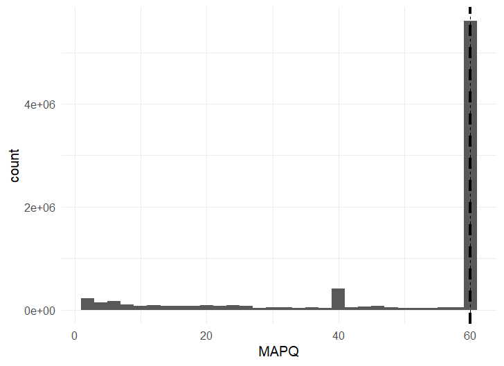

## Mapping Reads to the Reference Genome

To gain meaningful insights from sequencing data, we first need to determine where each read originates from in the genome. This process is called **mapping** or **alignment**, where sequencing reads are matched to a reference genome. There are many mapping tools available, often tailored for specific data types - for example, STAR or HISAT for RNA-seq, minimap2 for long reads, miniprot for protein sequences.   
In this workflow, we use **BWA-MEM**, a widely used algorithm within the BWA software suite, to align paired-end reads to a reference genome.


### Step 1. Index the Reference Genome

Before mapping, the reference genome must be indexed with BWA. Assuming `$GENOME` points to the reference FASTA file (e.g., `GENOME="./genome/refgenome.fasta"`), indexing is performed using:

```bash
bwa index $GENOME
```

For downstream applications, it is often useful to also generate a .fai index using SAMtools:

```bash
samtools faidx $GENOME
```

### Step 2. Map Paired-End Reads

Assuming that `$READ1` and `$READ2` point to the the forward and reverse fastq files (optionally gzipped) of an individual (e.g. `READ1="./reads/Sample01_Loc1_1.fq.gz"` and `READ2="./reads/sample01_Loc1_2.fq.gz"`), `$SAMPLE` refers to the sampleID of an individual (`SAMPLE="Sample01_Loc1"`) and `$BAM_OUT` to the output file (`BAM_OUT="./bam/Sample01_Loc1.bam"`) the full command to map paired reads to a reference genome is:

```bash
bwa mem "$GENOME" "$READ1" "$READ2" | samtools view -bS | samtools sort -o "$BAM_OUT"
```

Let's break down the command. The first part, `bwa mem "$GENOME" "$READ1" "$READ2"` does the actual alignment of the reads to the reference genome and outputs a SAM file—a text-based format containing alignment information. Since SAM files are large, they're typically converted to the more compact, binary BAM format using the program **samtools**. This is done on-the-fly using a pipe (`|`), which passes the SAM output directly into **samtools view**. The `-bS` flags tell **samtools** view to convert from SAM (`-S`) to BAM (`-b`).  

Finally, since most downstream tools require BAM files sorted by genomic position, we sort the output using **samtools sort** and save it as the final BAM file with `-o "$BAM_OUT"`. It's best to name the output file using the individual's ID, matching entries in the `samples.txt` file. 
Once the mapping is completed, an index file is created (**samtools index**) to enable fast and efficient access to specific regions within the BAM without reading the entire file using the command `samtools index "$BAM_OUT"`

While mapping can be done sequentially for each individual, it is more efficient on a computing cluster to run mappings in parallel. The mapping and sample processing commands are then specified in a script that is submitted to the cluster. The following script (mapping.sh) automates this by reading paired fastq.gz files from the file samples.txt, mapping them, and outputting sorted BAM files named after each sample ID.

```bash

#!/bin/bash

cd ~/project

# Load modules
module load BWA
module load SAMtools

# Read sample name from file based on array task ID
SAMPLE=$(sed -n "${PBS_ARRAYID}p" ./samples/samples.txt)

# Define genome file
GENOME="./genome/refgenome.fasta"

# Define input and output files
READ1="./reads/${SAMPLE}_1.fq.gz"
READ2="./reads/${SAMPLE}_2.fq.gz"
BAM_OUT="./bam/${SAMPLE}.bam"

# Run BWA MEM, convert to BAM and sort
bwa mem -t 8 "$GENOME" "$READ1" "$READ2" | samtools view -bS | samtools sort -o "$BAM_OUT"
samtools index "$BAM_OUT"
```

### Step 3. Filter alignments
Every read alignment is given a quality score (MAPQ values), a score assigned to each read alignment in a SAM/BAM file that reflects how confidently that read has been placed at a particular position in the reference genome. Higher values mean that the aligner is very confident the read maps uniquely and correctly to the genome. Frequently used threshold value of MAPQ>20 or MAPQ>30 are often used to filetr out reads with low mapping quality. However these values depend on complexity of genome, data and aligners, so it's better to inspect the distribution of mapping values rather than setting a predefined fixed threshold. 

```bash
#Extract MAPQ values
module load SAMtools
for bam in *.bam; do
    samtools view "$bam" | awk '{print $5}' >> mapq.txt
done

#Plot MAPQ histogram in R
library(ggplot2)                                      #load library
mapq <- read.table("mapq.txt", col.names = "MAPQ")    #import data
p90 <- quantile(mapq$MAPQ, 0.90)                      #caculate 90% percentile
ggplot(mapq, aes(x = MAPQ)) + geom_histogram(binwidth = 2, boundary = 1) + geom_vline(xintercept = p90, linetype = "dashed",linewidth = 1.2) + theme_minimal()
```
In the first part we go over each BAM file, extract the 5th column (MAPQ values) and append it into a single mapq.txt file (you could opt to do it for each bam file separately though, or take a random subset of your alignments if the file gets too big). In the second part we plot a histogram with a mark at the 90th percentile (depending on how stringent you would like to filter).



The distribution allows you to keep a balance between stringency and data retention: you can choose a threshold that preserves as much useful data as possible while still filtering out low-confidence alignments. Here, even a cutoff value of 60 would allow for retaining 90% of the data (actually 99%).

Besides filtering out poorly mapped reads, we may also opt to remove unmapped, secondary and supplementary alignments as well as not properly paired reads. Not properly paired reads in pair-end sequening data refers to one read not being mapped, not having the expected orientation, mapped on a different chromosome or an unexpectedly large insert size. Unmapped reads are sequencing reads that could not be aligned to the reference genome (they will probably also be filtered out if you set a high MAPQ threshold). Secondary and supplemenatry alignment however do not necessarily have low MAPQ values. Secondary alignments occur when a read can map to multiple locations in the genome with similar alignment scores (one alignment is chosen as the primary alignment, the remaining alternative alignments are marked as secondary). Supplementary alignments represent split alignments, where different parts of a single read map to separate genomic locations.

```bash
module load SAMtools
THREADS=4
OUTDIR="bam_filter"
for bam in *.bam
do
    base=$(basename "$bam" .bam)
    samtools view -b -q 60 -F 2308 -f 2 -@ ${THREADS} "$bam"  | samtools sort -@ ${THREADS} -o "${OUTDIR}/${base}.clean.sorted.bam"
    samtools index -@ ${THREADS} "${OUTDIR}/${base}.clean.sorted.bam"
done
```

[!Note]
>_Note: not properly paired reads, secondary or supplementary alignments can result from low-quality reads or genuine structural genomic variation (e.g., deletions, duplications, inversions). Filtering these reads will remove both types indiscriminately. Therefore, consider your study’s objective carefully and avoid this filtering step when investigating structural variation. However, for many standard analyses applying this filter is appropriate and beneficial and will result in a set of high-confidence alignments._


