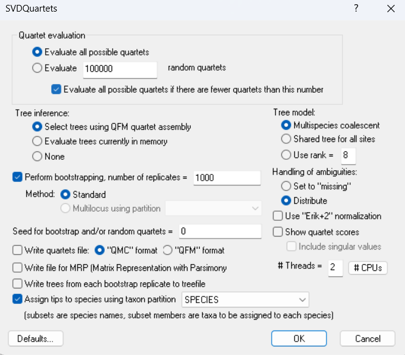

## A SNP-based species tree

Most species-tree inference methods use either gene trees or genetic sequences as input. These approaches generally assume that recombination is absent within these regions, such that each region represents a single underlying phylogenetic history. Because RADtags are typically shorter than 1200 bp, they often contain limited phylogenetic information, which can result in poorly resolved or unreliable gene-tree estimates. Conversely, concatenating all SNPs into a single alignment may lead to inflated node support and fails to account for potential variation in phylogenetic histories across different regions of the genome. An alternative approach that avoids these issues is Singular Value Decomposition Scores for Species Quartets (SVDQuartets) (Chifman and Kubatko, 2014), a species-tree inference method allowing each SNP to have its own evolutionary history, and estimates species-tree topology under the multispecies coalescent model. The latter however means no branch lengths can be inferred.
We will use PAUP* to estimate the SNP-based species tree using the SVDQuartets tool.

PAUP* does not accept vcf files and therefore we convert it to a NEXUS format using the script vcf2phylip.

```bash
python vcf2phylip.py --input ./vcf/project.HQ.minDP15.80shared.thin.vcf --phylip-disable --nexus
```
This code will generate a NEXUS matrix named project.HQ.minDP15.80shared.nex. --phylipl-disable prevents the creation of the PHYLIP matrix (default) and the --nexus flag points out you wish to vcf to be transformed into a nexus file. Note that the SVDQuartets tool is not that computationally demanding and hence a non-thinned file with no missing data is often used as an input file.   

Next, inform PAUP* which samples belong to which taxa by adding the following text to the end of nexus file: 
```
BEGIN SETS;
        TAXPARTITION SPECIES =
                ARC:1-5,
                BDA:6-10,
                BON:11-17,
                CC:18-22,
                CDC:23-27 78,
                CM:29-33,
                COR:34-38,
                GAR:39-43,
                GSL:44-48,
                MAR:49-50,
                PSA:51-55,
                RDA:56-59,
                SL:60-62,
                TRM:63-67,
                VAG:68-72,
                VDC:28 73-77;

  END;
```
Here, the first 5 sequences (1-5) of the nexus file belong to the taxa 'ARC', the next 5 sequences (6-10) to taxa 'BDA', and so on. 


Open PAUP*, click on 'File' and browse to your nexus file (cross the option "Execute" at the bottom of the screen). 
Define the outgroup (if available) by clicking on 'Data' and 'Define Outgroup'. 
Next we will perform the species tree estimation by clicking on 'Analysis' and 'SVDQuartets'. Use default settings, but select 'Evaluate all possible quartets', set the number of bootstrap values to 1000, select the 'Assign tips to species using taxon partition' so SVDQuartets knows which individual belongs to which taxa (see above) and set the output format (QMC format for example) and press 'ok'.

You almost immediately will obtain the topology of the species tree together with some information on the frequency of quartets that are compatible with the species tree topology and the frequency of quartets that are not in congruence with the species tree. These numbers provide information on the extent of incomplete lineage sorting or introgression among the taxa.
Finally, the species tree is plotted with bootstrap values indicating the support in each node.


Note: you can run the same analysis with all samples assigned as separate taxa to explore to what extent all samples of the same putative taxa form a monophyletic group.   

Reference.
Chifman, J. and L. Kubatko. 2014. Quartet inference from SNP data under the coalescent, Bioinformatics, 30(23): 3317-3324. 


